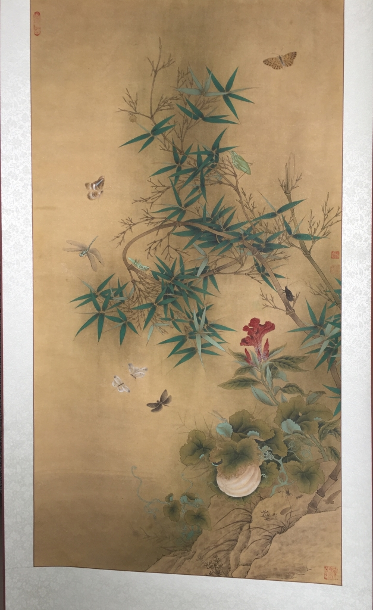
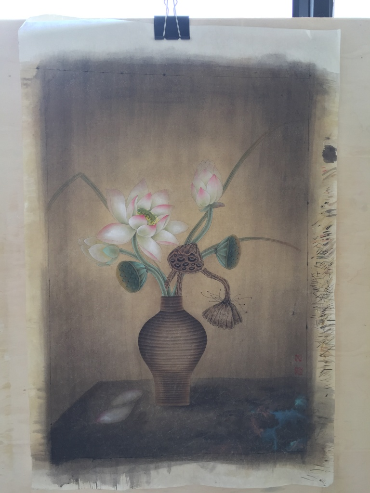

# 欢迎来到素心斋主个人网站

> 万培 
> 原名（万有培），笔名：素心斋主。
> 1990年出生与安徽省蚌埠市怀远县。
> 自幼喜欢绘画，擅长工笔花鸟，
> 画风朴实、清秀工整。
> 师从中国著名工笔花鸟画家李晓明先生。  

> 人生在无数个拐角兜兜转转，但始终能循着当初那份感动，跌跌撞撞的迎上去，我想，这样的人生无疑是让人敬佩的。
## 临宋竹虫图轴

## 原创 荷韵

## 临宋 雪堂客话

## 蜻蜓荷

## 牡丹 二乔春色

## 牡丹 瑶池贯月

## 原创 牡丹 色彩改编

## 白荷花

## 白荷花扇

## 茶花

## 茶花

